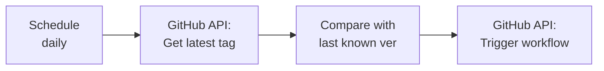

# Container Images

[](https://github.com/anthony-spruyt/container-images/blob/main/LICENSE)
[](https://github.com/anthony-spruyt/container-images/actions/workflows/ci.yaml)
[](https://github.com/anthony-spruyt/container-images/actions/workflows/trivy-scan.yaml)
[](https://github.com/anthony-spruyt/container-images/stargazers)
[](https://github.com/anthony-spruyt/container-images/forks)
[](https://github.com/anthony-spruyt/container-images/graphs/contributors)
[](https://github.com/anthony-spruyt/container-images/issues)

Container images built from upstream sources or custom Dockerfiles, published to GitHub Container Registry with automated security scanning and SLSA provenance.

## Development

See [DEVELOPMENT.md](DEVELOPMENT.md) for development environment setup.

## Usage

Pull an image:

```bash
docker pull ghcr.io/anthony-spruyt/firemerge:latest
```

## Adding a New Image

### Option 1: Build from Upstream Source

Use this when building from an external repository (e.g., a GitHub project):

1. Create a directory with the image name
2. Add `metadata.yaml`:

   ```yaml
   upstream: owner/repo
   version: "1.0.0"
   ```

3. Optionally add a custom `Dockerfile` to override the upstream's
4. Push to main - the image will be built and published automatically

### Option 2: Build from Local Dockerfile

Use this for custom images with no upstream source:

1. Create a directory with the image name
2. Add your `Dockerfile` and any required files
3. Add `metadata.yaml`:

   ```yaml
   version: "1.0.0"
   ```

4. Push to main - the image will be built and published automatically

### Automatic Configuration

- **Upstream validation** - Uses each image's own `metadata.yaml` as source of truth
- **Dependabot entries** - Auto-generated via pre-commit hook when `metadata.yaml` changes

## Adding a Custom MegaLinter Flavor

Custom MegaLinter flavors extend official flavors with additional linters. The `megalinter-factory/` directory contains tooling to generate flavor files from a simple configuration.

### Using Claude Code (Recommended)

The `/create-megalinter-flavor` command automates flavor creation with automatic base flavor selection:

```bash
# With specific linters
/create-megalinter-flavor my-ci ACTION_ACTIONLINT,MARKDOWN_MARKDOWNLINT,BASH_SHELLCHECK

# Interactive mode (prompts for linter selection)
/create-megalinter-flavor my-ci
```

The command will:

1. Validate the flavor name and check for conflicts
2. Look up linter configurations from the catalog
3. Auto-select the optimal base flavor (minimizing custom installs)
4. Generate `megalinter-<name>/flavor.yaml` with Renovate annotations

### Manual Setup

1. Create a directory for your flavor:

   ```bash
   mkdir megalinter-<name>/
   ```

2. Create `flavor.yaml` with your configuration:

   ```yaml
   name: my-flavor
   description: "MegaLinter for my use case"
   upstream: oxsecurity/megalinter
   upstream_version: "v9.3.0"
   base_flavor: ci_light # Options: ci_light, python, javascript, terraform, go, documentation, security

   custom_linters:
     # Binary from Docker image
     - linter_key: ACTION_ACTIONLINT
       type: docker_binary
       version: "1.7.7"
       digest: "sha256:..." # Optional: pin to specific digest

     # NPM package
     - linter_key: MARKDOWN_MARKDOWNLINT
       type: npm
       version: "0.44.0"

     # Pip package
     - linter_key: PYTHON_BANDIT
       type: pip
       version: "1.7.10"
   ```

3. Commit `flavor.yaml` - CI generates Dockerfile, test.sh, and metadata.yaml, then builds automatically

### Supported Linter Types

| Type            | Description                   | Example                    |
| --------------- | ----------------------------- | -------------------------- |
| `docker_binary` | Copy binary from Docker image | actionlint, lychee         |
| `npm`           | Install via npm               | markdownlint-cli, prettier |
| `pip`           | Install via pip               | bandit, pylint             |
| `go`            | Install via go install        | staticcheck                |
| `cargo`         | Install via cargo install     | clippy                     |

### Available Linters

See `megalinter-factory/linter-sources.yaml` for the complete catalog of available linters with their installation methods and default versions.

### Version Updates

Renovate automatically detects version updates in `flavor.yaml` via annotations:

```yaml
# renovate: datasource=docker depName=rhysd/actionlint
version: "1.7.10"
```

When Renovate creates a PR updating `flavor.yaml`, CI regenerates the Dockerfile and builds.

### Local Development

To test locally, generate files first:

```bash
pip install pyyaml jinja2
python megalinter-factory/generate.py megalinter-<name>/
```

Generated files (`Dockerfile`, `test.sh`, `metadata.yaml`) are regenerated by CI at build time.

## Build Triggers

### Automatic

Pushing changes to `metadata.yaml`, `Dockerfile`, or `flavor.yaml` on main triggers a build using the version in metadata.

### Manual / n8n Integration

Trigger via GitHub API (workflow_dispatch):

```bash
# Dry run (default) - builds and scans but doesn't push or release
curl -X POST \
  -H "Authorization: token $GITHUB_TOKEN" \
  -H "Accept: application/vnd.github.v3+json" \
  https://api.github.com/repos/anthony-spruyt/container-images/actions/workflows/build-and-push.yaml/dispatches \
  -d '{"ref":"main","inputs":{"image":"firemerge","version":"0.5.3"}}'

# Production build - pushes to GHCR and creates release
curl -X POST \
  -H "Authorization: token $GITHUB_TOKEN" \
  -H "Accept: application/vnd.github.v3+json" \
  https://api.github.com/repos/anthony-spruyt/container-images/actions/workflows/build-and-push.yaml/dispatches \
  -d '{"ref":"main","inputs":{"image":"firemerge","version":"0.5.3","dry_run":"false"}}'
```

Parameters:

- **image** (required): Image directory name (e.g., `firemerge`, `chrony`)
- **version** (optional): Semver tag to build (e.g., `0.5.3`) - checks out this tag from upstream
- **dry_run** (optional, default: `true`): When `true`, builds and scans the image but skips push to GHCR and release creation. Set to `false` for production builds.

## n8n Workflow

Create an n8n workflow to automatically trigger builds when upstream repos release new versions.

### Workflow Design



### Nodes

1. **Schedule Trigger** - Run daily (or use GitHub webhook for instant updates)

2. **Get Latest Release** - HTTP Request to GitHub API:

   ```text
   GET https://api.github.com/repos/lvu/firemerge/releases/latest
   ```

   Or for tags:

   ```text
   GET https://api.github.com/repos/lvu/firemerge/tags?per_page=1
   ```

3. **Compare Version** - Check if release already exists via GitHub releases API (pattern: `{image}-{version}` or `{image}-{version}-rN`)

4. **Trigger Build** - HTTP Request (only if new version):

   ```text
   POST https://api.github.com/repos/anthony-spruyt/container-images/actions/workflows/build-and-push.yaml/dispatches

   Headers:
     Authorization: Bearer $GITHUB_PAT
     Accept: application/vnd.github.v3+json

   Body:
     {
       "ref": "main",
       "inputs": {
         "image": "firemerge",
         "version": "{{ $json.name }}",
         "dry_run": "false"
       }
     }
   ```

   Note: Set `dry_run` to `"false"` for production builds. Default is `"true"` (dry run mode).

### Required Secrets

- **GitHub PAT** with `repo` and `workflow` scopes for triggering workflow_dispatch

## Security

See [SECURITY.md](SECURITY.md) for security policy and controls.

After creating the repository, apply the GitHub rulesets:

```bash
./.github/apply-rulesets.sh
```
